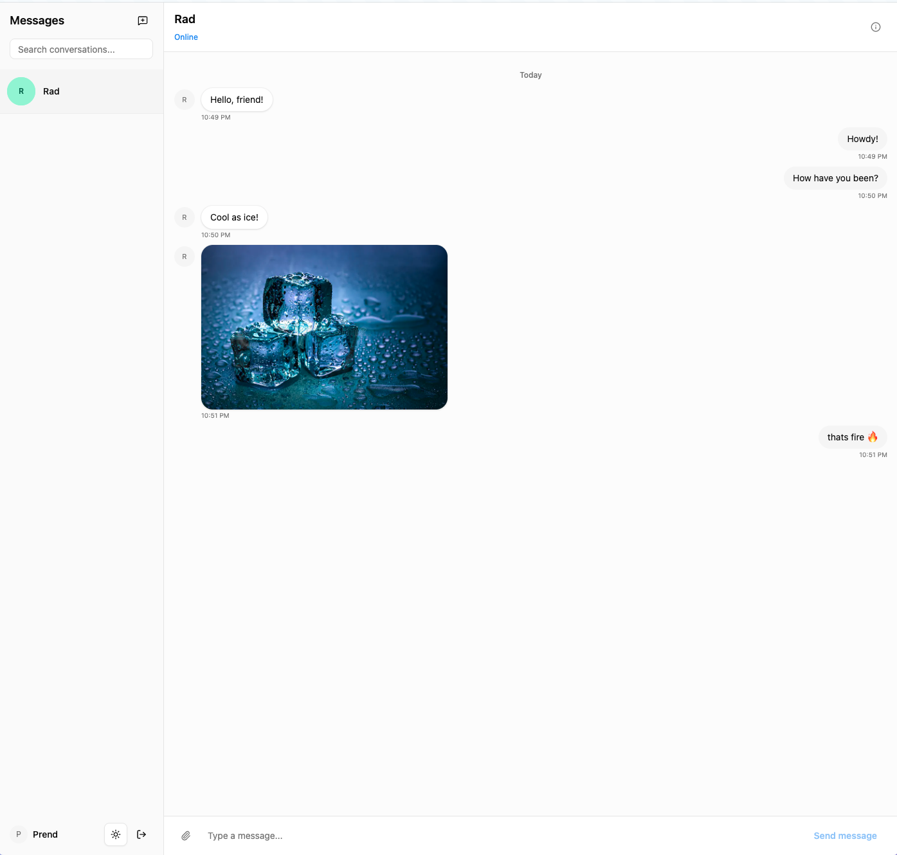

# Volt

**Real-time messaging**

Volt is a full-stack real-time chat application with a React frontend and a Rust backend. It supports direct and group conversations over WebSockets, image uploads, and light/dark mode.

  

## Features

- **Real-time messaging**: Instant delivery via WebSockets with per-conversation fan-out
- **Direct & group conversations**: One-on-one chats and multi-participant groups, with leave-group support
- **Message editing**: Sender-only edits, tracked via `edited`/`updated_at`
- **Image messages**: Upload endpoint returns a URL, sent through the same message path as text
- **Dark / light theme**: Toggleable UI theme with TailwindCSS
- **Type-safe end-to-end**: TypeScript on the client, compile-time checked SQL on the server

## Tech Stack

| Frontend    | Backend    |
| ----------- | ---------- |
| React       | Rust       |
| TypeScript  | Axum       |
| TailwindCSS | PostgreSQL |
| shadcn-ui   |            |

**Real-time:** WebSockets via Axum + Tokio broadcast channels

## Architecture

- **DDD-style layering**: `domain` (aggregates, invariants) → `application` (commands/queries) → `infrastructure`/`handlers` (Postgres, WebSocket, HTTP adapters)
- **CQRS-flavored read side**: Denormalized view queries (`ConversationView`, `MessageView`) built for what the client actually renders, separate from write-model aggregates
- **Event-driven fan-out**: Domain events (`MessageSent`, `MessageEdited`, `ParticipantRemoved`, ...) go through a Tokio broadcast bus; each WebSocket connection filters to its own participant conversations
- **Dependency injection**: Axum state extractors for clean handler signatures
- **Compile-time SQL**: SQLx macros verify queries against the database schema at build time
- **Custom error types**: Domain/query errors mapped to HTTP status codes via `IntoResponse`

## Future Features

Deferred: interesting design problems, not yet built:

- **Message reactions**: open question of whether a reaction lives inside `Message`'s consistency boundary or is its own aggregate referencing `Message` by id
- **Group admin roles**: restrict rename/remove-member to the conversation creator, extends `Conversation`'s invariants
- **Message soft-delete**: new domain concept, no `DomainEvent`/method for it yet
